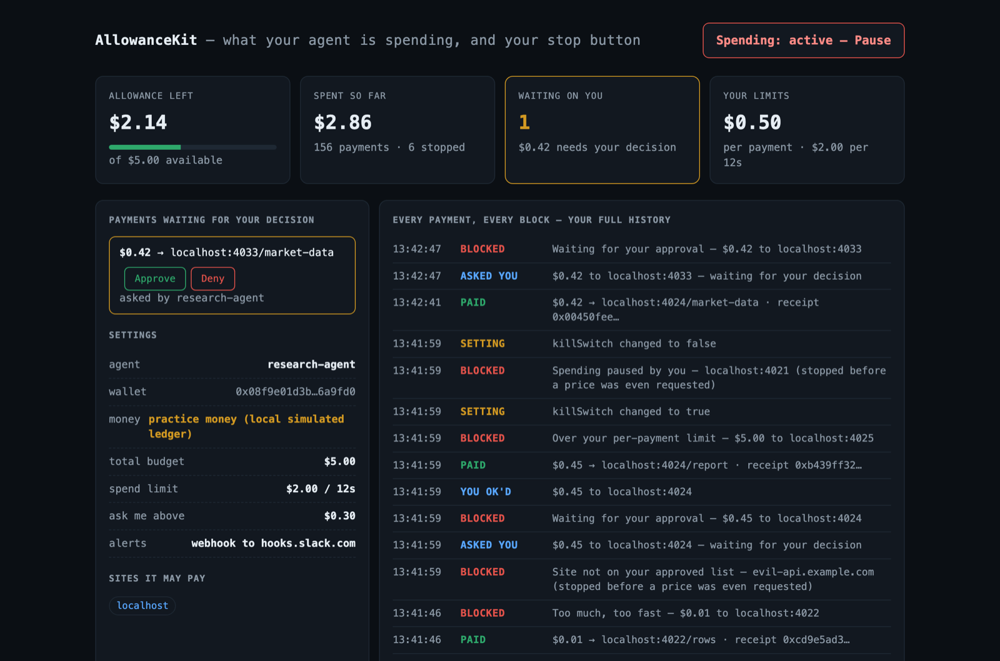

# AllowanceKit

**A spending allowance for your AI agent.** Fund it once. It pays any x402-priced API on its own — inside hard limits *you* set, with a kill switch and a receipt for every cent.

Landing page: [onewallie.com](https://onewallie.com) · Follow-along tutorial: [onewallie.com/docs.html](https://onewallie.com/docs.html)

```bash
npx allowance-kit demo          # watch the whole thing work, end to end (30 seconds)
npx allowance-kit init          # create the agent's wallet
npx allowance-kit topup 5.00    # fund the allowance
npx allowance-kit dashboard     # live spending, kill switch, approval queue
```



*The dashboard. One payment is parked for a human — nothing moves until someone decides.*

## What this does and does not cap

**It caps** payments your agent makes *through AllowanceKit* to x402-priced APIs — every call routed through `payingFetch`.

**It does not cap** your existing OpenAI, Anthropic, or cloud bill. Those are metered on an account, not paid per call over x402, and nothing here can stop them. If a surprise invoice from a metered API is the problem you're solving, this is not yet the tool for it.

### Is this for you?

- **Yes** if you're building an agent that calls paid APIs and you want a hard ceiling on what it can spend, plus an audit trail of every payment.
- **Yes** if you're selling an x402 API and want drop-in middleware — see [`paymentGate`](#sellers).
- **Not yet** if you want a cap on a credit card or on metered API accounts.

Requires **Node ≥ 20.11** to use the npm package. ESM only — `import`, not `require`. Zero runtime dependencies. Running this repo's TypeScript sources directly needs **Node ≥ 24**; on older versions run `npm install && npm run build` first.

---

## Practice money by default

Out of the box, settlement runs on a local simulated ledger. Every dollar in the CLI, the demo and the dashboard is practice money, and the tool says so at every money touchpoint. Nothing real can move until you deliberately wire a real rail ([sellers](#sellers) via `CdpFacilitator`, [buyers](#live-networks) via `createLiveAgent`).

That is the point: you can prove the rails hold before any real funds are at risk.

---

## The one-import SDK

```ts
import { createAgent, topUp, payingFetch } from "allowance-kit";

const agent = createAgent(".allowance");        // same default agent the CLI manages
topUp(agent, 5);                                // fund the allowance (practice money)

// The host allowlist is default-deny. Allow the destination first:
agent.policyStore.save({ allowHostSuffixes: ["api.example.com"] });

const res = await payingFetch(agent.ctx, "https://api.example.com/weather?city=lisbon");
if (res.ok) console.log(res.body, res.costMicro, res.txHash);
else console.log(res.blockedBy);  // { rule, detail, recoverable, quotedMicro, capMicro, retryAfterMs?, requestId? }
```

`createAgent(stateDir, agentName)` files spend, top-ups and the remaining allowance under `agentName`. The CLI uses `DEFAULT_AGENT_NAME` (`"research-agent"`); pass the same name in code or the agent will look unfunded.

### Agents can act on a block, not just log it

`blockedBy` carries enough to self-correct:

| Field | Use |
|---|---|
| `rule` | a closed union — `switch` on it exhaustively |
| `recoverable` | `false` means retrying will never help; stop |
| `quotedMicro` / `capMicro` | how far over the limit the price was → retry a cheaper tier |
| `retryAfterMs` | how long until the velocity window clears → back off |
| `requestId` | the queued approval to escalate to a human |

```ts
const res = await payingFetch(agent.ctx, url);
switch (res.blockedBy?.rule) {
  case "velocity_circuit_breaker": await sleep(res.blockedBy.retryAfterMs!); break;
  case "per_call_cap":             return tryCheaperTier(res.blockedBy.quotedMicro!, res.blockedBy.capMicro!);
  case "human_approval_required":  return askHuman(res.blockedBy.requestId!);
  case "budget_exhausted":         return giveUp("out of allowance");
}
```

---

## Why this exists (research, Aug 2026)

The agentic payment infrastructure **is live and scaling**:

| Signal | Number |
|---|---|
| x402 network volume (last 30 days) | **75.4M payments · $24.2M** (~$0.32 avg — true micropayments) |
| x402 Foundation | Linux Foundation; founding members incl. Visa, Mastercard, Stripe, Google, AWS, Cloudflare |
| Alipay AI-initiated payments | 120M in one week (Feb 2026) |
| MPP (Stripe/Tempo) | mainnet Mar 2026, 100+ services |

But the buyer side is broken. Verified evidence from primary sources:

1. **x402 issue #1759 (open): "agent onboarding is too complex"** — a top-10 ecosystem operator reports users abandoning x402 because there is *"no install-and-go experience"*: manual wallet setup, funding, config, and *"no wallet UI showing balance, transaction history."*
2. **Runaway agents are real**: documented cases of agents burning $8,400+ in overnight retry loops. Facilitators verify payments are *valid*; nothing checks whether they're *sane*.
3. **EU AI Act Article 26 (in force Aug 2, 2026)**: deployers of spending agents must keep tamper-evident logs, enforce human oversight, and can be fined up to 3% of global turnover. x402 settles inline with zero audit trail.
4. Every existing fix (Crossmint guardrails, Coinbase Agentic Wallets, XPay firewall) is a proprietary platform account. Nothing is open, self-hostable, protocol-native, and installable in one command.

AllowanceKit is that missing piece: the **allowance layer between the human and the agent's wallet**.

## The rails

The agent calls `payingFetch(ctx, url)` instead of `fetch(url)`. That handles the whole protocol — 402 challenge → price discovery → two-phase authorization → signed payment → settle → receipt — while the policy engine enforces:

| Rail | Rule | Blocked pre-payment |
|---|---|---|
| `killSwitch` | human freeze, instant | ✅ |
| `host_not_allowlisted` / `blockedHosts` | default-deny destinations | ✅ |
| `per_call_cap` | max price per single call | ✅ |
| `velocity_circuit_breaker` | rolling-window spend limit (kills retry loops) | ✅ |
| `budget_exhausted` | hard total: the agent can spend `min(totalBudgetUsd, amount funded)` | ✅ |
| `human_approval_required` | escalation gate above threshold | ⏸ blocked & queued until you approve |
| `settlement_rejected` | the seller refused the payment; nothing was spent | ✅ logged |

Two properties worth stating plainly:

- **Authorization is atomic.** Deciding and reserving happen inside one state-dir lock, and in-flight payments count as spent until they settle. Twenty parallel `payingFetch` calls against a $1.00/60s velocity limit settle exactly $1.00 — a retry storm cannot fan out past the breaker.
- **`totalBudgetUsd` is enforced, not decorative.** The spendable ceiling is the smaller of what you configured and what you funded.

Approvals are real: an above-threshold call is blocked and queued (`allowance-kit approvals` or the dashboard). Approving creates a standing grant for that host+price — **it does not execute the payment**; the agent completes it on its next attempt. Every step is in the ledger.

The kill switch and approval queue are **token-gated**: mutating dashboard endpoints require the local control token (auto-generated into `.allowance/dashboard-token`, injected into the served UI).

Every decision — paid or blocked, with rule, reason and tx hash — lands in an append-only JSONL ledger (`.allowance/ledger.jsonl`) that satisfies EU AI Act Art. 26 §5 logging. Read it as a table with `allowance-kit audit`, or as raw JSONL with `allowance-kit audit --json`.

## CLI

```
init                            provision the agent wallet in ./.allowance
topup <usd>                     add to the allowance
status                          what is left, what the limits are, what needs you
policy [field value]            show or change one limit
approvals                       payments waiting for your decision
approve <id> | deny <id>        decide one
audit [--json]                  the full spending history
notify [webhook|email|test|off] where alerts are sent, and on what
dashboard [--port <n>]          live dashboard (default http://localhost:4030)
demo                            run the built-in demo into ./.allowance-demo

--state <dir>                   state directory (default ./.allowance, or $ALLOWANCE_STATE_DIR)
```

Limits: `totalBudgetUsd`, `perCallMaxUsd`, `windowLimitUsd`, `windowSeconds`, `requireApprovalAboveUsd`, `allowHostSuffixes`, `blockedHosts`, `killSwitch`. Unknown fields are rejected, not silently written, and combinations where one rail shadows another produce a warning.

```bash
npx allowance-kit policy perCallMaxUsd 0.10
npx allowance-kit policy allowHostSuffixes api.weather.com,api.search.com
npx allowance-kit policy killSwitch true      # freeze everything, right now
```

## Alerts, so nobody has to watch a screen

A dashboard only helps someone who is looking at it. The runs that hurt happen overnight.

```bash
npx allowance-kit notify webhook https://hooks.slack.com/services/...   # Slack, Discord, Zapier, your own server
npx allowance-kit notify email you@example.com --from alerts@you.com    # needs a provider key, below
npx allowance-kit notify test                                           # send one of each now, report delivery
npx allowance-kit notify                                                # show what is set up
npx allowance-kit notify off                                            # stop sending anything
```

You get told about three things:

- **Spending**, at 50%, 80% and 100% of the allowance. Once per threshold, not once per payment. Topping up rearms them.
- **Every block** — which rail refused, what it tried to pay, and that nothing moved.
- **Every payment waiting on you**, with the `approve` and `deny` commands to settle it.

Email goes through a provider's REST API, not SMTP, so the package keeps its zero-dependency promise. Set one key in your environment — **never in a config file**:

```bash
export RESEND_API_KEY=...        # for --via resend (the default)
export POSTMARK_API_TOKEN=...    # for --via postmark
```

`notifications.json` in the state dir holds the address and the provider. It never holds the key, so it is safe to read, copy, or paste into a bug report.

Alerts are best-effort by construction: delivery is never awaited inside the ledger lock, a webhook that hangs cannot slow a payment down, and one that errors cannot fail one. `notify test` is how you find out whether it works, rather than discovering it at 3am.

## Architecture

```
src/
  index.ts          public API — `import { payingFetch, createAgent, topUp } from "allowance-kit"`
  types.ts          x402 wire types (PaymentRequired, PaymentPayload, receipts)
  money.ts          integer micro-dollar math (no float drift)
  chain.ts          settlement + Facilitator interface {verify, settle}
                    MockChain = deterministic local ledger w/ replay protection,
                    snapshots to disk. Swap for a real facilitator by
                    implementing 2 methods — nothing else changes.
  facilitator-cdp.ts Coinbase CDP facilitator: verify/settle over the x402 v1
                    facilitator contract with ES256 request-signed JWTs
                    (node:crypto only). For sellers settling real USDC on Base.
  live.ts           live-network agent runtime: real x402 v1 EVM payloads
                    (EIP-3009 TransferWithAuthorization, EIP-712 signed via
                    optional viem) against any live x402 endpoint.
  seller.ts         paymentGate(): drop-in x402 middleware for any node:http route
  payer.ts          payingFetch(): the agent-side client (two-phase authorization)
  policy.ts         PolicyStore (hot-reloaded JSON) + evaluatePolicy() + field validation
  lock.ts           state-dir mutex (in-process + cross-process, stale-safe)
  reservations.ts   authorized-but-unsettled spend, so parallel calls can't overspend
  approvals.ts      human-approval queue (request → decide → standing grant)
  wallet.ts         agent runtime: stable wallet identity, funding, authorization gate
  ledger.ts         append-only audit log (parse-cached, single-pass totals)
  demo-servers.ts   five x402-priced APIs used by the demo
  demo-run.ts       the demo story, shipped in the package as `allowance-kit demo`
  dashboard-server.ts + public/dashboard.html   live UI; kill switch & approvals
                    are token-gated (.allowance/dashboard-token)
test/               zero-dependency node --test suite
```

The wire format follows x402 v1 (`HTTP 402` + `accepts[]` + base64 `X-PAYMENT` / `X-PAYMENT-RESPONSE` headers).

### Sellers

```ts
import { paymentGate, CdpFacilitator } from "allowance-kit";

paymentGate(
  {
    priceMicro: 10_000n,               // $0.01 == 10k atomic USDC units
    description: "Weather lookup",
    payTo: "0xYourMerchantAddress",
    network: "base-sepolia",
    facilitator: new CdpFacilitator(), // reads CDP_API_KEY_ID / CDP_API_KEY_SECRET
  },
  handler,
);
```

### Live networks

```ts
import { payingFetch, createLiveAgent } from "allowance-kit";

const live = await createLiveAgent({ stateDir: ".allowance", privateKey: process.env.AGENT_KEY! });
const res = await payingFetch(live.ctx, "https://some-live-x402-api.com/data");
```

Signing needs the optional peer dependency [`viem`](https://viem.sh) (`npm i viem`); everything else stays zero-dep. Policy, approvals, kill switch and the audit ledger apply identically to simulated and live spending.

## Demo output (abridged)

`npx allowance-kit demo`:

```
PHASE 1 · fine-grained pay-per-use
  PAID    weather?city=lisbon            $0.001000  0xcddcb9a6…
  PAID    research?topic=agent-payments  $0.250000  0x4e5bc352…

PHASE 2 · runaway loop
  PAID    loop #1…#149                   $0.010000 each
  BLOCKED loop #150  Too much, too fast  rolling 12s spend would exceed $2.00

PHASE 3 · attack, mispricing & approval gate
  BLOCKED evil-api.example.com  Site not on your approved list
  BLOCKED report?id=q3-2026     Waiting for your approval ($0.45 ≥ $0.30 → queued)
  PAID    report?id=q3-2026 (retry)      $0.450000 (approved grant)
  BLOCKED feed?key=pro          Over your per-payment limit ($5 > $0.50)

PHASE 4 · kill switch
  BLOCKED weather?city=berlin   Spending paused by you

spent $2.443 across 155 settled payments; 5 policy blocks enforced
remaining allowance: $2.557 of $5.00 practice money
```

## Business model

See [BUSINESS.md](BUSINESS.md).

## Honest limitations

- Default settlement is a local mock ledger — **all funds are simulated**. Real settlement ships two ways: sellers settle real USDC via `CdpFacilitator`, buyers sign real x402 v1 payments via `createLiveAgent` (needs optional `viem`). Untested against mainnet until first live transaction — treat the first runs as canary.
- **Alerts go out over webhook and email only.** There is no SMS and no push. Email needs a Resend or Postmark key you supply; without one, nothing sends and `notify` says so plainly rather than failing quietly.
- **Alerts are best-effort, not guaranteed.** They are fired without being awaited so they can never fail a payment, which also means a dropped webhook is not retried. The ledger, not your inbox, is the record of what happened.
- The CLI manages a single agent per state dir; multi-agent is a schema change (`agentName` already threads everywhere).
- Approved grants are standing per host+amount — no expiry and no per-grant spend cap yet.
- The dashboard binds to `127.0.0.1` and gates all mutations behind a token, but `GET /api/state` is unauthenticated to anything already on the loopback interface.
- npm ships compiled `dist/` (ESM + `.d.ts`, zero runtime deps).

## Changes in 0.3.0

Added:

- **Notifications.** `notify webhook`, `notify email`, `notify test`, `notify off`. Alerts fire at 50/80/100% of the allowance, on every block, and on every payment queued for a human. Webhook payloads carry both a Slack/Discord-shaped `text` field and flat structured detail. Email goes over Resend or Postmark's REST API; the key is read from the environment and never written to disk. New exports: `NotifyStore`, `Notifier`, `deliver()`, `defaultNotifyConfig`, `providerEnvVar()`, and the `NotifyConfig` / `NotifyEvent` / `NotifyMessage` types. `AgentRuntime` gained `notifyStore`.
- **The CLI answers to the name you typed.** Run it as `wallie` and every hint it prints back says `npx wallie`; run it as `allowance-kit` and they say `npx allowance-kit`. The dashboard follows the same name. A bare `node dist/cli.js` falls back to the published name rather than printing `npx cli`.
- The dashboard's Settings panel shows where alerts go, or says nobody is told.

`wallie` on npm is an alias for this package: same CLI, same SDK, the name [onewallie.com](https://onewallie.com) uses.

## Changes in 0.2.0

Breaking:

- `totalBudgetUsd` is now **enforced**. An agent funded above its configured budget stops at the budget. Previously the field was display-only and the funded amount was the real cap.
- `PolicyStore.save()` throws `PolicyValidationError` on unknown fields, wrong types and negative amounts. Previously typos were written silently.
- `PaidResult` gained a required `quotedMicro`; `blockedBy.rule` narrowed from `string` to the `PolicyRule` union and gained `recoverable`.
- `buildPolicyRails()` requires `stateDir` (it owns the lock and the reservation store).
- `recordPayment` / `recordBlocked` may return a promise.

Added: `topUp()`, `DEFAULT_AGENT_NAME`, `RULE_LABELS`, `POLICY_FIELDS`, `validatePolicyPatch()`, `policyWarnings()`, `effectiveBudgetMicro()`, `ReservationStore`, `runDemo()`, and `allowance-kit` as a second bin name.

Fixed: parallel `payingFetch` calls can no longer overspend the velocity or budget rails; seller-rejected payments now set `error`, log a `settlement_rejected` ledger row and release the hold; `init` prints real file paths; the dashboard allowance meter measures the allowance instead of the spend.
